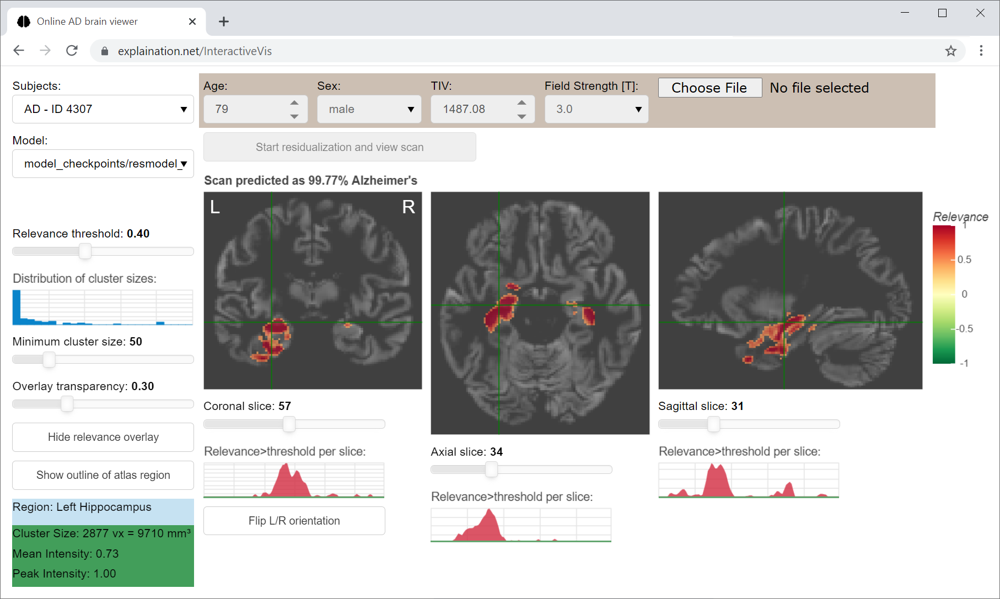
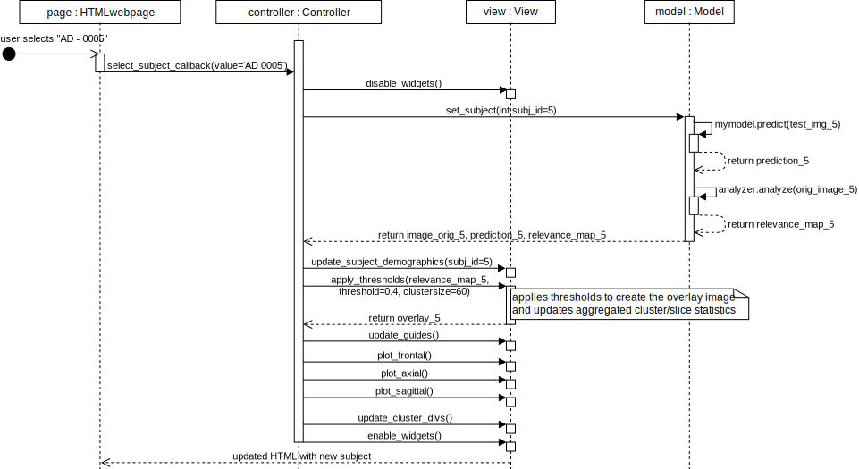

# Interactive Visualization Web App

**Further details on the procedures including samples, image processing, neural network modeling, evaluation, and validation were published in:**

Dyrba et al. (2021) Improving 3D convolutional neural network comprehensibility via interactive visualization of relevance maps: evaluation in Alzheimer’s disease. *Alzheimer's research & therapy* 13. DOI: [10.1186/s13195-021-00924-2](https://doi.org/10.1186/s13195-021-00924-2).

*Screenshot of the InteractiveVis app*

***

## Setup

Download this Git repository.
Make sure that all dependencies are installed in your Python environment.
Go to the parent directory DeepLearningInteractiveVis and execute:
`pip install -r requirements.txt`

If required, modify the header of [config.py](config.py) to load the correct data and CNN model.

## Running

The interactive bokeh application `InteractiveVis` can be run for inspecting the created relevance maps overlaid on the original input images.

Here, point the Anaconda/command line prompt to the parent directory DeepLearningInteractiveVis and then run bokeh using:

`bokeh serve InteractiveVis --show`

***

### InteractiveVis architecture overview

*InteractiveVis UML class diagram (v4)*

*Select subject UML sequence diagram (v3)*

***

### License:

Copyright (c) 2020 Martin Dyrba martin.dyrba@dzne.de, German Center for Neurodegenerative Diseases (DZNE), Rostock, Germany

This project and included source code is published under the MIT license. See [LICENSE](../LICENSE) for details.
